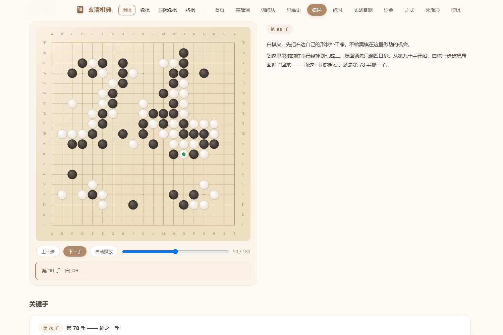

# 玄清棋典 · RapaceClassic

## ⬇️ 下载

**[Releases 页面](https://github.com/Rapace7/RapaceClassic/releases) → 拉到底 → `RapaceClassic.html`**

下完**双击**，浏览器打开就行。约 7.7 MB。

> 文件名和仓库名一致。内容全是中文，只是文件名用了英文 ——
> GitHub 会把中文附件名显示成 `default.html`。

**不会用 GitHub 也能拿**：打开上面那个链接 → 往下滑找到 **v1.0** →
下面 **Assets** 区块点那个文件 → 下载。不需要注册、不需要登录。

---

> **一个 HTML 文件** —— 下载、双击、用浏览器打开，就这么简单。不用装任何东西。

围棋词典：术语、定式、死活形、名局详解、基础课、实战自测。
所有题目的答案都由程序推演验证过。

---

## 里面长什么样



*名局详解 —— 李世石 vs AlphaGo 第四局，第 90 手。右边跟着这一手的解说，
下面还有「关键手」把第 78 手那记「神之一手」标出来。棋盘可以逐手走，
自动播放也行。*

其他板块：基础课（64 课）· 训练法 · 思维史 · 练习（77 道带推理）·
词典 · 定式 · 死活形 · 摆棋 · 实战自测。
另有象棋、国际象棋、将棋各一套。

---

## 怎么用

**下载 `玄清棋典.html` → 双击 → 浏览器打开。**

- 只需要一个浏览器（Chrome / Edge / Firefox 都行）
- **不需要联网**，不需要安装
- 数据全在这个文件里（约 7.7 MB）

## 里面有什么

| 板块 | 内容 |
|---|---|
| 基础课 | 64 课系统教程 |
| 训练法 | 棋理、算路、教学方法 |
| 思维史 | 围棋观念演变 |
| 名局 | 51 盘名局详解 |
| 练习 | 77 道带完整推理的练习 |
| 词典 | 术语详解（手筋、棋形、布局…） |
| 定式 | 常见定式与变化 |
| 死活形 | 死活题库 |
| 摆棋 | 任意摆棋研究 |
| 实战自测 | 随机抽题考自己 |

四种棋类：**围棋 · 象棋 · 国际象棋 · 将棋**。

## 两点说明

- **进度不记、不排名、不上传** —— 打开就查，关闭就走。
- 内容来源于网络公开资料。

## 浏览器兼容

在 Edge / Chrome 上验证通过（零 JS 报错、零外部请求）。
个别旧版浏览器可能对个别新式 JS 语法不兼容。

---

## 从源码构建

`玄清棋典.html` 是**构建产物**，仓库里的 `src/` 是它的来源。

```bash
python build.py        # src/* → 玄清棋典.html（单文件内联）
```

改完内容重新跑一次即可。构建结果与已发布的产物**逐字节一致**（可验证）。

```
玄清棋典.html   交付产物：单文件，双击即开
build.py        打包脚本：把 src/* 内联成上面那个单文件
src/            源码（开发用多文件，改完必须重新 build.py）
  index.html    页面骨架
  style.css     样式
  app.js        围棋应用逻辑：路由 / 渲染 / 答题器 / 详解联动
  ...           棋盘、引擎、术语、课程、名局、各棋种数据
```

## 许可

代码部分：MIT。
内容来源于网络公开资料。
